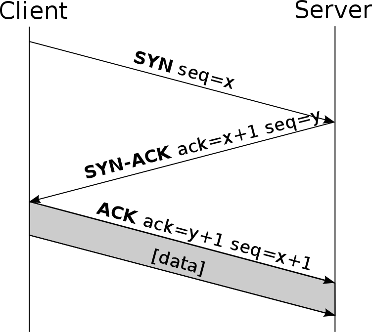

# TCP/IP

## Inleiding

TCP/IP is een verzamelnaam voor een reeks netwerkprotocollen die gebruikt worden voor het grootste deel van de netwerkcommunicatie tussen computers. Protocollen zorgen voor een duidelijke structuur en eenheid om communicatie vlot te laten verlopen. Het grootste en bekendste TCP/IP-netwerk is het internet. De naam bestaat uit de twee bekendste protocollen: Transmission Control Protocol (TCP) en Internet Protocol (IP).

TCP/IP specifieert hoe data wordt uitgewisseld via end-to-end communicatie. Deze bepaalt hoe de data opgesplitst, geadresseerd, verzonden, gerouteerd en ontvangen moet worden. De functionaliteit wordt onderverdeeld in 5 lagen: de fysieke laag, data linklaag, netwerklaag, transportlaag en applicatielaag.

## Geschiedenis

In de late jaren zestig was het Amerikaanse ministerie van Defensie op zoek naar een manier om computers met elkaar te verbinden over het hele land. Dit project werd het ARPANET genoemd. Deze periode werd natuurlijk gekenmerkt door de Koude Oorlog waardoor ze vooral bezorgd waren over een mogelijke nucleaire aanval. Daarom werd het ARPANET zo ontworpen dat het ook zou blijven werken indien een deel van het netwerk werd platgelegd door een bom. Het project slaagde en groeide uit tot het internet dat we vandaag de dag kennen. 

Het internet is dus een open netwerk waarop men gebruik maakt van het TCP/IP-protocol om gegevens uit te wisselen. Het is een pakket-geschakeld protocol waarbij de pakketjes onafhankelijk van elkaar worden verzonden. Bij de ontvangst worden de pakketjes weer in de juist volgorde geplaatst. Ook worden er eventuele fouten gedetecteerd om indien nodig bepaalde pakketjes opnieuw te verzenden.

## TCP

Het Transmission Control Protocol is verbindings-georiënteerd protocol dat veel gebruikt wordt voor gegevensoverdacht. In tegenstelling tot een verbindingsloos protocol zoals UDP is er bij TCP wel de garantie dat de gegevens volledig aankomen. 

De netwerkverbindingen worden door middel van een TCP-handshake gemaakt en aan het eind van een TCP-sessie verbroken met een handshake voor het beëindigen. 

### Netwerkverbinding maken

1.	De client (die de aanvraag doet) stuurt een TCP-pakket naar de server met een zogenaamde SYN-vlag. Hierin staat over welk soort applicatie het gaat.
2.	Als de server de verbinding accepteert stuurt deze een pakket terug met zowel een SYN- als een ACK-vlag. 
3.	De client antwoordt op zijn beurt dan weer met een ACK-vlag.

Hierna kan de feitelijke overdracht van gegevens gebeuren. Dit gebeurt onder de vorm van TCP-segmenten. Dit segment bevat een deel van het bestand dat moet worden verstuurd en een header. In de header staat de informatie over het soort applicatie.  Bij elk pakket dat verstuurd wordt, wordt het identificatienummer gecontroleerd. Indien er een fout inzit kan het pakket nogmaals verstuurd worden zodanig dat alle pakketjes zeker hun doel bereiken.

### Netwerkverbinding verbreken

1.	De initiator verstuurt een TCP-pakket met FIN-vlag naar de ontvanger.
2.	Nadat de ontvanger de FIN-vlag heeft gekregen, stuurt deze zijn laatste TCP-pakket met ACK-vlag naar de initiator
3.	De ontvanger stuurt vervolgens een FIN-vlag naar de initiator om aan te geven dat de verbinding kan verbroken worden.
4.	De initiator stuurt ten slotte een TCP-pakket met ACK-vlag naar de ontvanger om de verbinding definitief te verbreken.

## IP

Het Internet Protocol (IP) zorgt voor de routering en adressering van de data-pakketten zodat ze via het netwerk op hun bestemming aankomen. Elk apparaat dat geconnecteerd is met het internet krijgt een IP-adres toegewezen. Aan elk pakket wordt de IP-adressering meegegeven zodat zo hun bestemming bereiken. 

Wanneer je naar een website wil surfen ga je natuurlijk nooit het IP-adres van de server in je browser intikken. Je geeft de domeinnaam in en via DNS (Domain Name System) wordt dit omgezet in het bijhorende IP-adres.

### IPv4

De vierde versie van IP werd geïntroduceerd in 1983. Het bestaat uit 32 bits, meestal weergegeven in vier 8-bit getallen gescheiden door punten. Elk 8-bit getal kan een waarde van 0 tot en met 255 bevatten. 

Het ene deel van het IP-adres bepaalt het netwerknummer en het andere deel bepaalt het hostnummer. Een apart netmasker bepaalt welke bits bij welk nummer horen. Computers met hetzelfde netwerknummer (dus binnen eenzelfde netwerk) kunnen rechtstreeks met elkaar communiceren. Hosts met een verschillend netwerknummer moeten verbinding maken via verschillende routers. 

Hoewel IPv4 vandaag de dag nog zo goed als overal gebruikt wordt, wordt er toch hard gewerkt aan de opvolger (IPv6). Door het gebruik van 32 bits om de informatie op te slaan is het aantal mogelijk IPv4-adressen niet eindeloos. Met 4,3 miljard beschikbare adressen lijkt het probleem niet zo groot, maar door het steeds groeiende netwerk aan apparaten wereldwijd is het nodig om over te schakelen naar een groter systeem.

### IPv6

De grote verbetering met IPv4 zit in de lengte van het adres. Een IPv6-adres bestaat uit 128 bits en wordt weergeven met 32 hexadecimale cijfers. Deze worden normaal geschreven als acht groepen van vier hexadecimale cijfers gescheiden door dubbelepunten. 

## Lagen

Het TCP/IP-protocol wordt onderverdeeld in vijf lagen, elk met een eigen functionaliteit. 

Laag | Functionaliteit
--- | ---
Applicatie | Routeringsprotocollen zoals HTTP (Hyper Text Transfer Protocol), SMTP (Simple Mail Transfer Protocol) en FTP (File Transfer Protocol)
Transport | Zorgt voor de communicatie via protocollen zoals TCP en UDP
Netwerk | Zorgt ervoor dat de aangeboden data van de bron naar de bestemming wordt gestuurd via het IP
Data Link | Ethernet
Fysieke | Maakt de fysieke connectie tussen de netwerken mogelijk. 

## Bronnen

https://nl.wikipedia.org/wiki/TCP/IP

https://searchnetworking.techtarget.com/definition/TCP-IP

http://cage.ugent.be/~avandael/Ailo/Seminaries2001/les11en12mieke.pdf

https://nl.wikipedia.org/wiki/Transmission_Control_Protocol

https://nl.wikipedia.org/wiki/TCP-handshake

https://www.cloudflare.com/learning/ddos/glossary/internet-protocol/